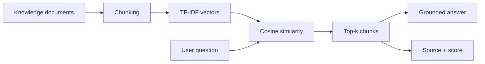
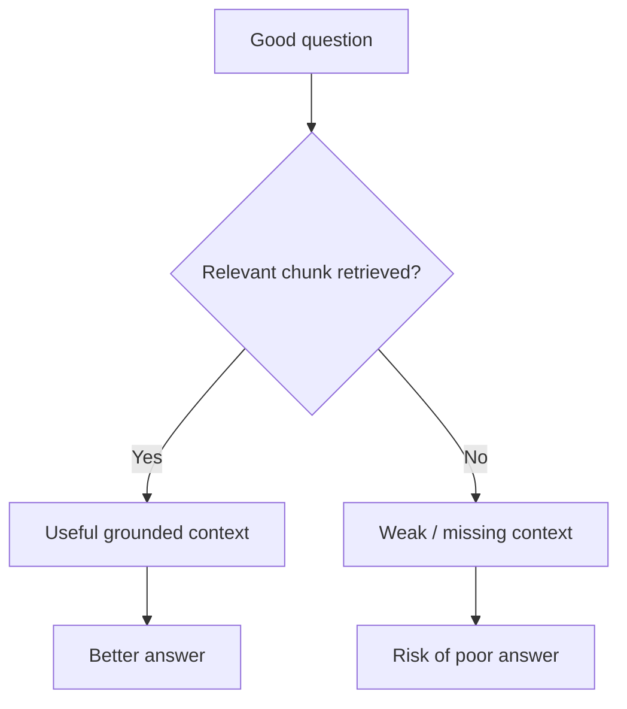
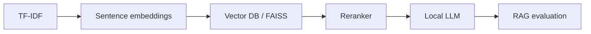

# Local RAG Knowledge Assistant

> A visual RAG teaching demo that exposes the retrieval process instead of hiding it behind an API.  
> **Local · No API key · Generic teaching documents only**

## RAG at a glance



## What the learner sees

```text
Question
  │
  ▼
"What is idempotency in a data pipeline?"
  │
  ▼
┌──────────────────────────────┐
│ Top retrieved context        │
│ Reliable Data Pipelines      │
│ similarity score: shown      │
└──────────────────────────────┘
  │
  ▼
Grounded answer + source
```

The Streamlit interface also exposes the remaining top-k chunks, so retrieval quality can be discussed directly.

## Why retrieval matters



This is useful for teaching a key RAG concept: **generation quality depends heavily on retrieval quality**.

## Demo questions
- What is a data lakehouse?
- Why do we need a semantic layer?
- What is idempotency in a data pipeline?
- What does RAG do?

## Quick start
```bash
python -m venv .venv
pip install -r requirements.txt
streamlit run app.py
```

## From classroom baseline to production RAG



## Topics I can teach
RAG · chunking · vectorization · cosine similarity · top-k retrieval · grounding · hallucination · embeddings · vector databases · reranking · evaluation

## Privacy & security
No cloud API, API key, credentials, private documents or past-company information are included.