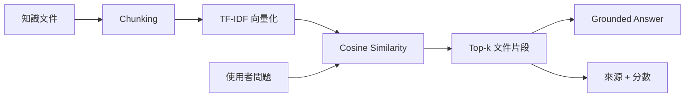
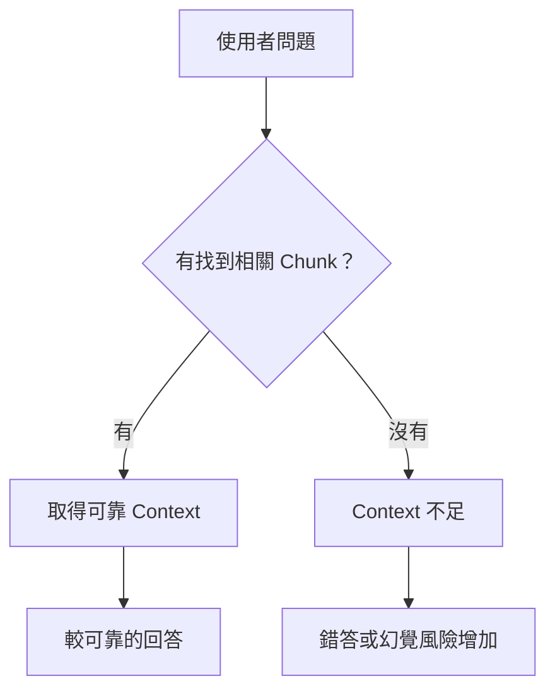
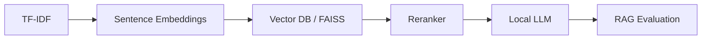

# 本地端 RAG 知識助理

[English](README.md) | **繁體中文**

> 將 Retrieval 流程完整呈現的 RAG 教學 Demo，而不是把所有步驟隱藏在 API 後方。  
> **本地執行 · 不需要 API Key · 僅使用通用教學文件**

## RAG 流程



## 使用者會看到什麼？

```text
問題
 │
 ▼
"What is idempotency in a data pipeline?"
 │
 ▼
Top retrieved context
Reliable Data Pipelines
Similarity score
 │
 ▼
Grounded answer + source
```

Streamlit 介面會同時顯示 Top-k Retrieval 結果，因此可以直接比較不同 chunk 的相關程度。

## 為什麼 Retrieval 很重要？



這個 Demo 可以用來說明 RAG 的核心觀念：**生成品質不只取決於 LLM，也高度受到 Retrieval 品質影響。**

## Demo 問題

- What is a data lakehouse?
- Why do we need a semantic layer?
- What is idempotency in a data pipeline?
- What does RAG do?

## 執行方式

```bash
python -m venv .venv
pip install -r requirements.txt
streamlit run app.py
```

## 從教學版走向完整 RAG



## 可延伸教學主題

RAG · Chunking · Vectorization · Cosine Similarity · Top-k Retrieval · Grounding · Hallucination · Embeddings · Vector Database · Reranking · Evaluation

## 資料安全

不使用 Cloud API、API Key 或帳密，也不包含私人文件、真實公司文件或過去公司的內部資訊。
